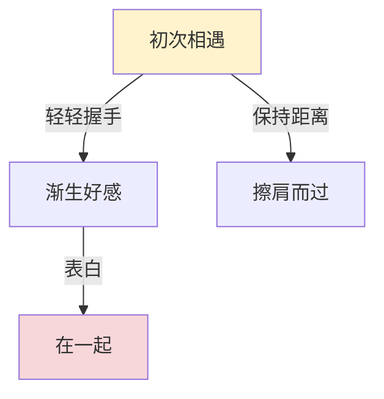

# plot - 剧情图与分支故事系统

## 概述

`plot` 是 NekoBot 3.0 的剧情模式模块，实现分支故事图（Branching Plot Graph）系统。每轮对话后 AI 自动生成 3 个不同级别的选择项，玩家选择后形成剧情分支，构建出树状剧情图。系统通过三个桥接模块将剧情事件自动同步到记忆、世界书和多媒体子系统。

**核心特性：**
- **AI 选择生成** - 每轮自动生成 3 个选择（普通/重要/转折），输出为可直接发送的第一人称消息
- **剧情图管理** - 节点 → 选择 → 边的有向图结构，支持回溯和 Mermaid 可视化
- **三级桥接** - 选择自动写入记忆（重要+）、世界书（转折点）、触发多媒体动作
- **回溯支持** - 可回退到任意历史节点重新选择

## 架构总览

```
AI 回复
  │
  ▼
PlotChoiceGenerator.generate()
  │  调用 AI 生成 3 个选择项
  │  ┌─────────────────────────────────┐
  │  │ 普通 (normal)    - 保守回应     │
  │  │ 重要 (important) - 推进关系     │
  │  │ 转折 (turning)   - 剧情转折     │
  │  └─────────────────────────────────┘
  ▼
PlotGraphManager
  ├── add_node()        创建剧情节点
  ├── add_choice()      记录选择项
  │
  │  玩家选择后：
  ├── select_choice()   标记选择
  │   ├── PlotMemoryBridge      → 写入角色记忆
  │   ├── PlotWorldBookBridge   → 写入世界书（转折点）
  │   └── MultimediaBridge      → 触发表情包/TTS/场景描述
  │
  ├── add_edge()        建立节点连接
  └── generate_mermaid() 输出剧情图可视化
```

## 核心类

### PlotNode

剧情节点，代表故事中的一个时刻。

```python
from nbot.plot import PlotNode

node = PlotNode(
    conversation_id="conv_abc",
    character_id="char_xyz",
    title="初次相遇",
    summary="在公园里偶遇了角色",
    level="important",
    scene={"location": "公园", "time": "傍晚"},
)
```

| 字段 | 类型 | 说明 |
|------|------|------|
| `conversation_id` | `str` | 所属会话 |
| `character_id` | `str` | 关联角色 |
| `title` | `str` | 节点标题 |
| `summary` | `str` | 剧情摘要 |
| `level` | `str` | 重要性：`normal` / `important` / `turning_point` / `ending` |
| `scene` | `dict` | 场景信息（地点、时间等） |
| `state_snapshot` | `dict` | 角色状态快照 |
| `relationship_snapshot` | `dict` | 关系状态快照 |
| `parent_node_id` | `str` | 父节点 ID |
| `selected_choice_id` | `str` | 已选择的选项 ID |

### PlotChoice

玩家的剧情选择项。

```python
from nbot.plot import PlotChoice

choice = PlotChoice(
    node_id="pn_abc",
    text="轻轻握住她的手",
    level="important",
    intent="推进关系",
)
```

| 字段 | 类型 | 说明 |
|------|------|------|
| `node_id` | `str` | 所属节点 ID |
| `text` | `str` | 选择文本（第一人称可发送消息） |
| `level` | `str` | `normal` / `important` / `turning_point` / `ending` / `hidden` |
| `intent` | `str` | 选择意图描述 |
| `selected` | `bool` | 是否已被选择 |

### PlotEdge

连接两个节点的边，表示选择导致的剧情走向。

| 字段 | 类型 | 说明 |
|------|------|------|
| `from_node_id` | `str` | 起始节点 |
| `to_node_id` | `str` | 目标节点 |
| `choice_id` | `str` | 关联的选择 ID |
| `label` | `str` | 边标签 |

### PlotGraphManager

剧情图管理器，负责节点/选择/边的 CRUD、选择处理和 Mermaid 导出。通过 `get_plot_graph_manager()` 获取全局单例。

```python
from nbot.plot import get_plot_graph_manager

manager = get_plot_graph_manager(data_dir="data")

# 添加节点
node = manager.add_node(node)

# 添加选择项
choice = manager.add_choice(choice)

# 玩家选择后
manager.select_choice("pc_abc")

# 建立边连接
manager.create_edge_for_choice("pc_abc", "pn_def", "握住手")

# 查询剧情图
graph = manager.get_graph("conv_abc")
# 返回 {"nodes": [...], "choices": [...], "edges": [...]}

# Mermaid 可视化
mermaid_code = manager.generate_mermaid("conv_abc")
```

### PlotChoiceGenerator

AI 驱动的选择生成器。每轮调用 AI 生成 3 个不同级别的选择项。

```python
from nbot.plot import PlotChoiceGenerator

generator = PlotChoiceGenerator(ai_client)
choices = generator.generate(
    response_text=ai_reply,
    turn_context=turn_context,
    session_context=session_context,
)
# 返回 3 个 PlotChoice: normal / important / turning_point
```

**选择生成规则：**
- 三个选择分别对应：保守回应、推进关系、剧情转折
- 输出为第一人称可直接发送的消息（不是元指令）
- 自动将"告诉她……""问她……"等元指令转换为第一人称消息
- AI 无响应时回退到默认选择（温柔回应/深入关系/戏剧转折）

## 桥接模块

### PlotMemoryBridge - 记忆桥接

选择被标记后，根据级别自动写入角色记忆：

| 选择级别 | 记忆类型 | 说明 |
|----------|----------|------|
| `normal` | 不写入 | 普通选择不产生记忆 |
| `important` | `relationship` | 关系相关记忆 |
| `turning_point` | `event` | 重要事件记忆 |
| `ending` | `long` | 长期记忆 |

### PlotWorldBookBridge - 世界书桥接

当剧情到达转折点时，自动将事件写入世界书：
- 优先级：80
- 条目类型：`event`
- 标签：`["plot", "turning_point"]`
- 自动从中文文本提取关键词（2-4 字，最多 5 个）

### MultimediaBridge - 多媒体桥接

根据选择级别触发不同的多媒体动作：

| 选择级别 | 触发的动作 |
|----------|-----------|
| 所有级别 | 表情包（强度随级别递增：0.3 / 0.6 / 0.9 / 1.0） |
| `turning_point` | TTS 语音 + 场景描述 |
| `ending` | TTS 语音 + 剧情回顾（Markdown 格式） |

此外提供辅助方法：
- `build_status_card()` - 角色状态卡（姓名、心情、精力、场景、关系）
- `build_group_layout()` - 群聊布局（含发言指示器）

## Web API

| 方法 | 路由 | 说明 |
|------|------|------|
| POST | `/api/plot/toggle` | 开启/关闭会话的剧情模式 |
| GET | `/api/plot/<conversation_id>/graph` | 获取完整剧情图 |
| GET | `/api/plot/<conversation_id>/latest-choices` | 获取最新未选择的选择项 |
| GET | `/api/plot/<conversation_id>/mermaid` | 获取 Mermaid 图表代码 |
| POST | `/api/plot/<conversation_id>/select` | 选择一个选项 |
| POST | `/api/plot/<conversation_id>/rollback` | 回溯到指定节点 |

### 开启剧情模式

```bash
curl -X POST /api/plot/toggle \
  -H "Content-Type: application/json" \
  -d '{"session_id": "sess_abc", "enabled": true}'
```

### 选择剧情分支

```bash
curl -X POST /api/plot/conv_abc/select \
  -H "Content-Type: application/json" \
  -d '{"choice_id": "pc_xyz"}'
```

## 目录结构

```
nbot/plot/
├── __init__.py            # 模块入口
├── models.py              # 数据模型（PlotNode / PlotChoice / PlotEdge）
├── graph_manager.py       # 剧情图管理器
├── choice_generator.py    # AI 选择生成器
├── memory_bridge.py       # 记忆桥接
├── world_book_bridge.py   # 世界书桥接
└── multimedia_bridge.py   # 多媒体桥接
```

## 数据存储

```
data/web/
└── plot_graphs.json       # 剧情图数据（节点、选择、边）
```

## Mermaid 可视化

剧情图支持导出为 Mermaid `graph TD` 语法，可在 Web UI 中直接渲染：



节点样式：
- 默认：白色
- `important`：黄色
- `turning_point`：粉色
- `ending`：青色

## 使用示例

### 基本流程

```python
from nbot.plot import get_plot_graph_manager, PlotChoiceGenerator

# 1. 开启剧情模式后，每轮 AI 回复自动生成选择
generator = PlotChoiceGenerator(ai_client)
choices = generator.generate(response_text, turn_ctx, session_ctx)

# 2. 将选择展示给玩家（Web UI 自动处理）
for c in choices:
    print(f"[{c.level}] {c.text}")

# 3. 玩家选择后，系统自动：
#    - 标记选择
#    - 创建边连接
#    - 桥接到记忆/世界书/多媒体
#    - 生成新的剧情节点等待下一轮选择
```

### 回溯剧情

```python
manager = get_plot_graph_manager(data_dir="data")

# 回溯到某个节点，重新开始
manager.rollback_to_node("pn_abc", conversation_id="conv_abc")
```
